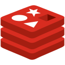
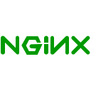

### Hi folks , I'm Carlos Gómez!

---

I am a DevOps/Cloud engineer from Medellín, Colombia. I'm currently working on  @globant as a Sr DevOps Engineer. I love system design solutions, automating things, build pipelines, write IaC, develop things and think about information security. I came from on-premise world but when I discovered cloud computing I think my life changed.  

I will try to help Open Source initiatives and also create an online presence of me - sharing the things that I do every day.  

Also, I'm trying to create something big in my city (Medellín, Colombia) - an entertainment center called @sport360

⚡ Fun facts:

- Seems that I know a lot of things - but for me it's a little lake compared with the ocean that I would like to know. BTW, in some things my knowledge is not too deep that I would like.

- Most of the time I don't have idea what I'm doing.  

😄 Pronouns: ... He/him

---

### 🔭 My skills include

                  

---

### 🌱 Currently learning about

      

---

### 📫 Contact Me on Social Media
- [ Twitter](https://twitter.com/cmgomezm15)
- [ LinkedIn](https://www.linkedin.com/in/cmgomezm15/)
- [ Instagram](http://instagram.com/cmgomezm15)
- [ Medium](https://medium.com/@cmgomezm15)
